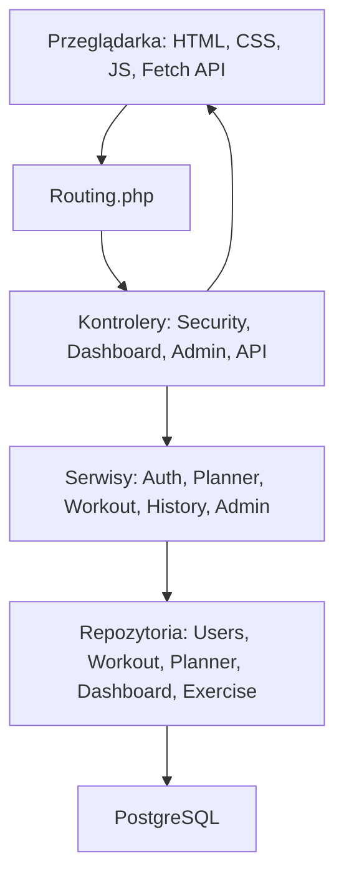

# Hipertrof.io

Aplikacja webowa do prowadzenia treningu siłowego. Użytkownik może wybrać gotowy plan, utworzyć własny plan od zera, modyfikować ćwiczenia, rozpocząć trening zgodnie z aktywnym planem, zapisywać serie, ciężar, liczbę powtórzeń, RPE oraz notatkę treningową. Aplikacja udostępnia historię treningów, atlas ćwiczeń oraz panel administratora do zarządzania użytkownikami, ćwiczeniami i odznakami.

Projekt został wykonany bez frameworka backendowego i bez gotowych szablonów UI.

## Technologie

- Docker i Docker Compose
- PHP 8.3, programowanie obiektowe
- PostgreSQL 16
- HTML5
- CSS, podział na moduły i media queries
- JavaScript, w tym Fetch API
- Git
- PHPUnit / testy smoke

## Funkcjonalności

- Rejestracja i logowanie użytkownika
- Utrzymanie sesji PHP
- Wylogowanie
- Role użytkowników: `user`, `admin`
- Ochrona tras wymagających logowania
- Panel administratora:
  - zarządzanie użytkownikami
  - aktywacja/dezaktywacja ćwiczeń
  - zarządzanie odznakami
- Planer treningowy:
  - wybór gotowego planu
  - tworzenie planu od zera
  - prywatna kopia szablonu przy edycji
  - dodawanie ćwiczeń do dni planu
  - edycja serii i zakresu powtórzeń
  - zmiana kolejności ćwiczeń
  - usuwanie własnych planów i ćwiczeń z planu
- Sesja treningowa:
  - trening prowadzony według aktywnego planu
  - zapisywanie ciężaru i powtórzeń
  - opcjonalne RPE dla serii
  - opcjonalna notatka do treningu
  - pomijanie serii lub ćwiczenia
  - zakończenie treningu z potwierdzeniem
- Historia:
  - lista poprzednich treningów
  - podsumowanie objętości, serii i ćwiczeń
  - szczegóły serii, RPE i notatek
- Atlas ćwiczeń:
  - lista ćwiczeń
  - filtrowanie i wyszukiwanie przez Fetch API
  - ćwiczenia używane przy budowaniu planu
- Dashboard:
  - aktywny plan
  - ostatni trening
  - ostatnie sesje
  - odznaki użytkownika
  - statystyki objętości i partii mięśniowych

## Uruchomienie

Wymagania:

- Docker Desktop
- Docker Compose

Kroki:

```bash
cp .env.example .env
docker compose up --build
```

Aplikacja:

```text
http://localhost:8080
```

PgAdmin:

```text
http://localhost:5050
login: admin@example.com
hasło: admin
```

Baza danych w kontenerze:

```text
host: db
port: 5432
database: db
user: docker
password: docker
```

Baza wystawiona na hosta:

```text
localhost:5433
```

## Zmienne środowiskowe

Plik przykładowy: `.env.example`

```env
DB_HOST=db
DB_NAME=db
DB_USER=docker
DB_PASSWORD=docker
```

`config.php` pobiera te wartości przez `getenv()`, a w razie ich braku używa domyślnych wartości zgodnych z Dockerem.

## Konta testowe

Dane przykładowe są ładowane z pliku `docker/db/init/init.sql`.

| Rola | Email | Hasło |
|---|---|---|
| Administrator | `admin@hipertrof.io` | `admin123` |
| Użytkownik | `user@wdpai.com` | `wdpai123` |
| Zablokowany użytkownik | `blocked@wdpai.com` | `wdpai123` |

## Architektura

Aplikacja jest zorganizowana w stylu MVC z dodatkową warstwą serwisów i repozytoriów.



Główne katalogi:

```text
public/views        widoki HTML/PHP
public/styles       moduły CSS
public/scripts      JavaScript i Fetch API
src/controllers     kontrolery
src/services        logika aplikacyjna
src/repositories    komunikacja z bazą danych
docker              konfiguracja kontenerów
tests               testy jednostkowe i smoke testy
```

## Routing

Wybrane trasy:

| Trasa | Opis |
|---|---|
| `/login` | logowanie |
| `/register` | rejestracja |
| `/logout` | wylogowanie |
| `/dashboard` | pulpit użytkownika |
| `/planer` | planer treningowy |
| `/session` | rozpoczęcie i prowadzenie treningu |
| `/atlas` | atlas ćwiczeń |
| `/history` | historia treningów |
| `/admin/users` | zarządzanie użytkownikami |
| `/admin/exercises` | zarządzanie ćwiczeniami |
| `/admin/badges` | zarządzanie odznakami |
| `/api/exercises/search` | wyszukiwanie ćwiczeń przez Fetch API |
| `/api/workout/start` | rozpoczęcie treningu przez Fetch API |
| `/api/workout/set` | zapis serii przez Fetch API |
| `/api/workout/skip` | pominięcie serii lub ćwiczenia |
| `/api/workout/finish` | zakończenie treningu |

## Baza danych

Plik inicjalizujący bazę i dane przykładowe:

```text
docker/db/init/init.sql
```

Najważniejsze tabele:

- `roles`
- `users`
- `user_profiles`
- `login_attempts`
- `muscle_groups`
- `equipment`
- `exercises`
- `exercise_muscle_groups`
- `workout_plans`
- `workout_plan_days`
- `workout_plan_exercises`
- `user_workout_plans`
- `workout_sessions`
- `performed_sets`
- `workout_session_plan_skips`
- `badges`
- `user_badges`

Relacje:

- jeden-do-wielu: `users -> workout_sessions`, `workout_plans -> workout_plan_days`, `workout_plan_days -> workout_plan_exercises`
- wiele-do-wielu: `exercises <-> muscle_groups`, `users <-> badges`, `users <-> workout_plans`
- jeden-do-jednego: `users -> user_profiles`

Widoki:

- `admin_user_overview`
- `user_training_summary`
- `weekly_muscle_group_summary`
- `exercise_usage_stats`
- `user_badge_overview`

Funkcje:

- `touch_updated_at()`
- `calculate_session_volume(p_session_id INTEGER)`
- `award_exercise_weight_badges()`

Triggery:

- `users_touch_updated_at`
- `user_profiles_touch_updated_at`
- `exercises_touch_updated_at`
- `workout_plans_touch_updated_at`
- `workout_plan_days_touch_updated_at`
- `user_workout_plans_touch_updated_at`
- `workout_sessions_touch_updated_at`
- `badges_touch_updated_at`
- `performed_sets_award_exercise_weight_badges`

Transakcje:

- w SQL: transakcja seedująca dane z poziomem izolacji `READ COMMITTED`
- w PHP: transakcje w repozytoriach przy tworzeniu użytkownika, planów, kopiowaniu planów, zmianach kolejności ćwiczeń i prowadzeniu treningu

Akcje referencyjne:

- `ON DELETE CASCADE`
- `ON DELETE RESTRICT`
- `ON DELETE SET NULL`

## Eksport bazy danych

W repo znajduje się kompletny plik inicjalizacyjny z danymi:

```text
docker/db/init/init.sql
```

Do dokumentacji dołączono również osobny eksport bazy danych:

- [bazakalinski.sql](<Dokumentacja i wymagania/bazakalinski.sql>)

## Bezpieczeństwo

Zastosowane mechanizmy:

- hasła przechowywane jako hash przez `password_hash()`
- weryfikacja haseł przez `password_verify()`
- prepared statements w PDO
- wyłączone emulowane prepared statements: `PDO::ATTR_EMULATE_PREPARES => false`
- CSRF token w formularzach i akcjach POST
- sesja PHP z cookie `HttpOnly` i `SameSite=Lax`
- kontrola ról i ochrona panelu administratora
- odpowiedzi HTTP: m.in. `400`, `401`, `403`, `404`, `409`, `429`, `500`
- escaping danych w widokach przez `htmlspecialchars`
- limit prób logowania oparty o tabelę `login_attempts`
- audyt nieudanych logowań bez zapisywania haseł
- blokada zablokowanego konta
- brak logowania haseł w logach aplikacji

## Fetch API

Fetch API jest używane między innymi do:

- wyszukiwania ćwiczeń w atlasie
- rozpoczęcia treningu
- zapisu serii
- pomijania serii lub ćwiczenia
- zakończenia treningu

Pliki:

```text
public/scripts/atlas.js
public/scripts/session.js
```

## Scenariusz testowy ręczny

1. Wejdź na `http://localhost:8080`.
2. Zaloguj się jako `user@wdpai.com` / `wdpai123`.
3. Sprawdź dashboard.
4. Przejdź do planera.
5. Wybierz gotowy plan albo utwórz własny plan od zera.
6. Dodaj ćwiczenie do wybranego dnia planu.
7. Wejdź w tryb edycji planu.
8. Zmień kolejność ćwiczeń.
9. Zmień liczbę serii lub zakres powtórzeń.
10. Zapisz zmiany.
11. Przejdź do `Rozpocznij trening`.
12. Rozpocznij sesję.
13. Zapisz serię z ciężarem i powtórzeniami.
14. Opcjonalnie wpisz RPE dla serii.
15. Pomiń serię lub ćwiczenie.
16. Zakończ trening i potwierdź modal.
17. Przejdź do historii i sprawdź zapisany trening.
18. Przejdź do atlasu i wyszukaj ćwiczenie.
19. Wyloguj się.

Scenariusz uprawnień:

1. Zaloguj się jako `user@wdpai.com`.
2. Wejdź na `/admin/users`.
3. Oczekiwany wynik: `403`.
4. Wyloguj się.
5. Zaloguj się jako `admin@hipertrof.io`.
6. Wejdź na `/admin/users`.
7. Zablokuj lub odblokuj użytkownika.
8. Wejdź na `/admin/exercises`.
9. Aktywuj lub dezaktywuj ćwiczenie.
10. Wejdź na `/admin/badges`.
11. Dodaj lub ukryj odznakę.

Scenariusz błędów:

1. Wejdź na `/dashboard` bez logowania.
2. Oczekiwany wynik: przekierowanie do logowania albo `401`.
3. Wejdź jako zwykły użytkownik na `/admin/users`.
4. Oczekiwany wynik: `403`.
5. Wykonaj kilka błędnych logowań.
6. Oczekiwany wynik: po przekroczeniu limitu aplikacja zwraca `429`.

## Testy automatyczne

Smoke test PowerShell:

```powershell
powershell -ExecutionPolicy Bypass -File tests\integration\smoke.ps1
```

Smoke test Bash:

```bash
bash tests/integration/smoke.sh
```

PHPUnit:

```bash
docker compose exec php vendor/bin/phpunit
```

Testy sprawdzają między innymi:

- logowanie
- dostęp do głównych podstron
- blokadę panelu administratora dla zwykłego użytkownika
- podstawowe elementy bezpieczeństwa kontrolera

## Diagram ERD

Diagram ERD znajduje się w folderze dokumentacji:

- [ERD.png](<Dokumentacja i wymagania/ERD.png>)


Proponowany zakres diagramu:

- użytkownicy i role
- profile użytkowników
- plany treningowe, dni planu i ćwiczenia planu
- ćwiczenia, sprzęt i partie mięśniowe
- sesje treningowe i wykonane serie
- odznaki użytkowników
- próby logowania

## Screeny aplikacji

Screeny wersji webowej i mobilnej znajdują się w folderze:

```text
Dokumentacja i wymagania/
```

### Wersja webowa


### Wersja mobilna


## Checklist wymagań

- [x] Docker
- [x] Git
- [x] HTML5
- [x] CSS
- [x] CSS media queries
- [x] JavaScript
- [x] Fetch API
- [x] PHP obiektowy
- [x] PostgreSQL
- [x] MVC / podział na kontrolery, serwisy, repozytoria i widoki
- [x] Logowanie
- [x] Rejestracja
- [x] Sesja użytkownika
- [x] Wylogowanie
- [x] Role użytkowników
- [x] Panel administratora
- [x] Uprawnienia i błąd `403`
- [x] CRUD / zarządzanie użytkownikami, ćwiczeniami i odznakami
- [x] Planer treningowy
- [x] Gotowe plany
- [x] Tworzenie własnego planu
- [x] Modyfikowanie planu
- [x] Sesja treningowa powiązana z aktywnym planem
- [x] Historia treningów
- [x] Atlas ćwiczeń
- [x] Odznaki
- [x] Relacje jeden-do-wielu
- [x] Relacje wiele-do-wielu
- [x] Relacja jeden-do-jednego
- [x] Minimum 2 widoki SQL
- [x] Minimum 1 trigger
- [x] Minimum 1 funkcja SQL
- [x] Transakcje
- [x] Akcje na referencjach PK/FK
- [x] Prepared statements
- [x] CSRF token
- [x] Hashowanie haseł
- [x] HttpOnly cookie
- [x] Escaping danych w widokach
- [x] Limit prób logowania
- [x] Audyt błędnych logowań
- [x] `.env.example`
- [x] Testy smoke
- [x] Diagram ERD w PNG/SVG
- [ ] Źródło diagramu ERD, np. `.drawio`
- [x] Screeny web/mobile
- [x] Osobny dump bazy danych
- [ ] Finalne commity i publiczne repozytorium

## Uwagi końcowe

Projekt spełnia główne wymagania funkcjonalne i technologiczne. Do dokumentacji dołączono ERD, screeny aplikacji oraz eksport bazy danych. Przed ostatecznym oddaniem pozostaje upewnić się, że repozytorium jest publiczne, zmiany są zapisane w commitach, a jeśli prowadzący wymaga źródła diagramu, należy dodać także plik `.drawio`.
